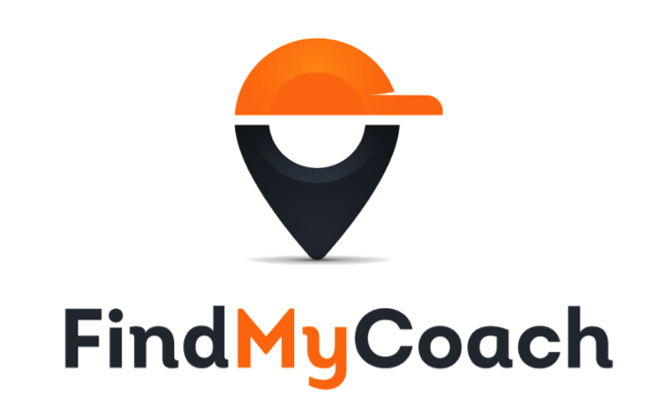

[![Contributors][contributors-shield]][contributors-url] [![Forks][forks-shield]][forks-url] [![Stargazers][stars-shield]][stars-url] [![Issues][issues-shield]][issues-url] [![MIT License][license-shield]][license-url] [![LinkedIn][linkedin-shield]][linkedin-url]

<!-- PROJECT LOGO -->
<br />
<p align="center">
  <a href="https://github.com/vominhtuan164/find-a-coach">
    
  </a>

  <h3 align="center">Find A Coach</h3>

  <p align="center">
  An app where a user can register as a coach or contact a registered coach
    <br />
    <a href="https://github.com/vominhtuan164/find-a-coach"><strong>Explore the docs »</strong></a>
    <br />
    <br />
    <a href="https://github.com/vominhtuan164/find-a-coach">View Demo</a>
    ·
    <a href="https://github.com/vominhtuan164/find-a-coach/issues">Report Bug</a>
    ·
    <a href="https://github.com/vominhtuan164/find-a-coach/issues">Request Feature</a>
  </p>
</p>

<!-- TABLE OF CONTENTS -->

## Table of Contents

- [About the Project](#about-the-project)
  - [Built With](#built-with)
- [Getting Started](#getting-started)
  - [Prerequisites](#prerequisites)
  - [Installation](#installation)
- [Roadmap](#roadmap)
- [Contributing](#contributing)
- [License](#license)
- [Contact](#contact)

<!-- ABOUT THE PROJECT -->

## About The Project

![Find A Coach Screen Shot][product-screenshot]

A web application, a website built with Vue.js which should help us find a coach. It has the find a coach feature, and it has a feature to send requests messages, to potential coaches which we want to contact.

### Built With

The major frameworks that I use to build my project.

- [VueJS](https://vuejs.org)
- [HTML](https://developer.mozilla.org/en-US/docs/Web/HTML)
- [CSS](https://developer.mozilla.org/en-US/docs/Web/CSS)

<!-- GETTING STARTED -->

## Getting Started

To get a local copy up and running follow these simple example steps.

### Prerequisites

- npm

```sh
npm install npm@latest -g
```

### Installation

1. Clone the repo

```sh
git clone https://github.com/vominhtuan164/find-a-coach.git
```

2. Install NPM packages

```sh
npm install
```

3. Compiles and hot-reloads for development

```sh
npm run serve
```

4. Compiles and minifies for production

```sh
npm run build
```

<!-- ROADMAP -->

## Roadmap

See the [open issues](https://github.com/vominhtuan164/find-a-coach/issues) for a list of proposed features (and known issues).

![Roadmap Screen Shot][roadmap-screenshot]

<!-- CONTRIBUTING -->

## Contributing

Contributions are what make the open source community such an amazing place to be learn, inspire, and create. Any contributions you make are **greatly appreciated**.

1. Fork the Project
2. Create your Feature Branch (`git checkout -b feature/AmazingFeature`)
3. Commit your Changes (`git commit -m 'Add some AmazingFeature'`)
4. Push to the Branch (`git push origin feature/AmazingFeature`)
5. Open a Pull Request

<!-- LICENSE -->

## License

Distributed under the GNU General Public License v3.0. See `LICENSE` for more information.

<!-- CONTACT -->

## Contact

Minh Tuan VO - [@my_linkedin](https://www.linkedin.com/in/minhtuanvo/) - vominhtuan164@gmail.com

Project Link: [https://github.com/vominhtuan164/find-a-coach/](https://github.com/vominhtuan164/find-a-coach/)

<!-- MARKDOWN LINKS & IMAGES -->
<!-- https://www.markdownguide.org/basic-syntax/#reference-style-links -->

[contributors-shield]: https://img.shields.io/github/contributors/vominhtuan164/find-a-coach.svg?style=flat-square
[contributors-url]: https://github.com/vominhtuan164/find-a-coach/graphs/contributors
[forks-shield]: https://img.shields.io/github/forks/vominhtuan164/find-a-coach.svg?style=flat-square
[forks-url]: https://github.com/vominhtuan164/find-a-coach/network/members
[stars-shield]: https://img.shields.io/github/stars/vominhtuan164/find-a-coach.svg?style=flat-square
[stars-url]: https://github.com/vominhtuan164/find-a-coach/stargazers
[issues-shield]: https://img.shields.io/github/issues/vominhtuan164/find-a-coach.svg?style=flat-square
[issues-url]: https://github.com/vominhtuan164/find-a-coach/issues
[license-shield]: https://img.shields.io/github/license/vominhtuan164/find-a-coach.svg?style=flat-square
[license-url]: https://github.com/vominhtuan164/find-a-coach/blob/master/LICENSE
[linkedin-shield]: https://img.shields.io/badge/-LinkedIn-black.svg?style=flat-square&logo=linkedin&colorB=555
[linkedin-url]: https://www.linkedin.com/in/minhtuanvo/
[product-screenshot]: images/screenshot.png
[roadmap-screenshot]: images/roadmap.png
